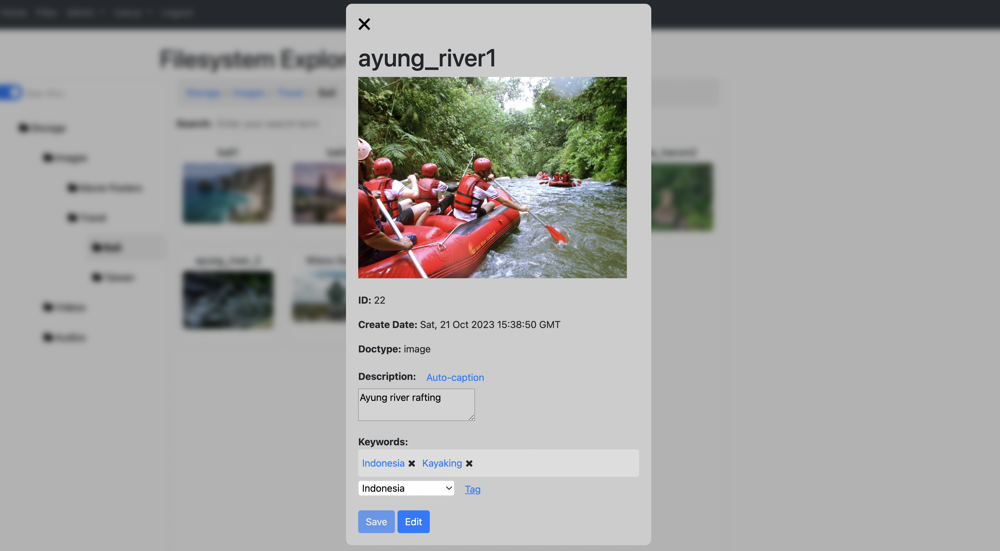
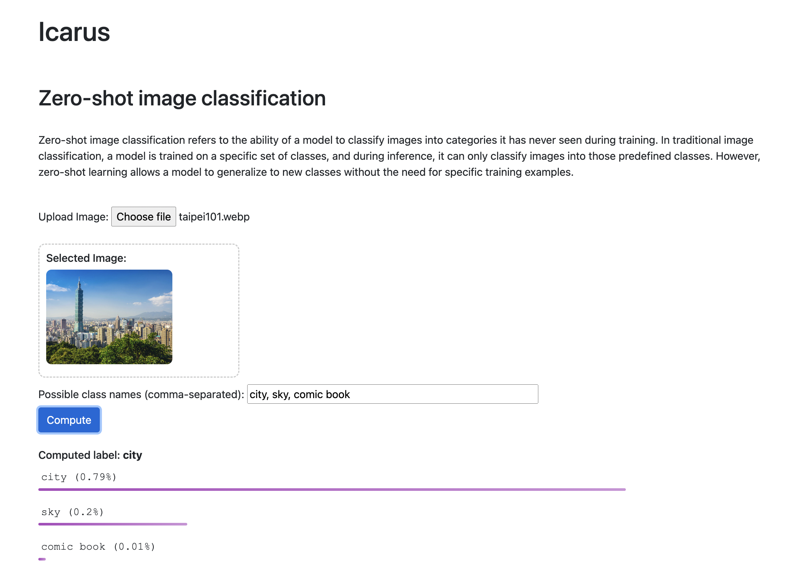
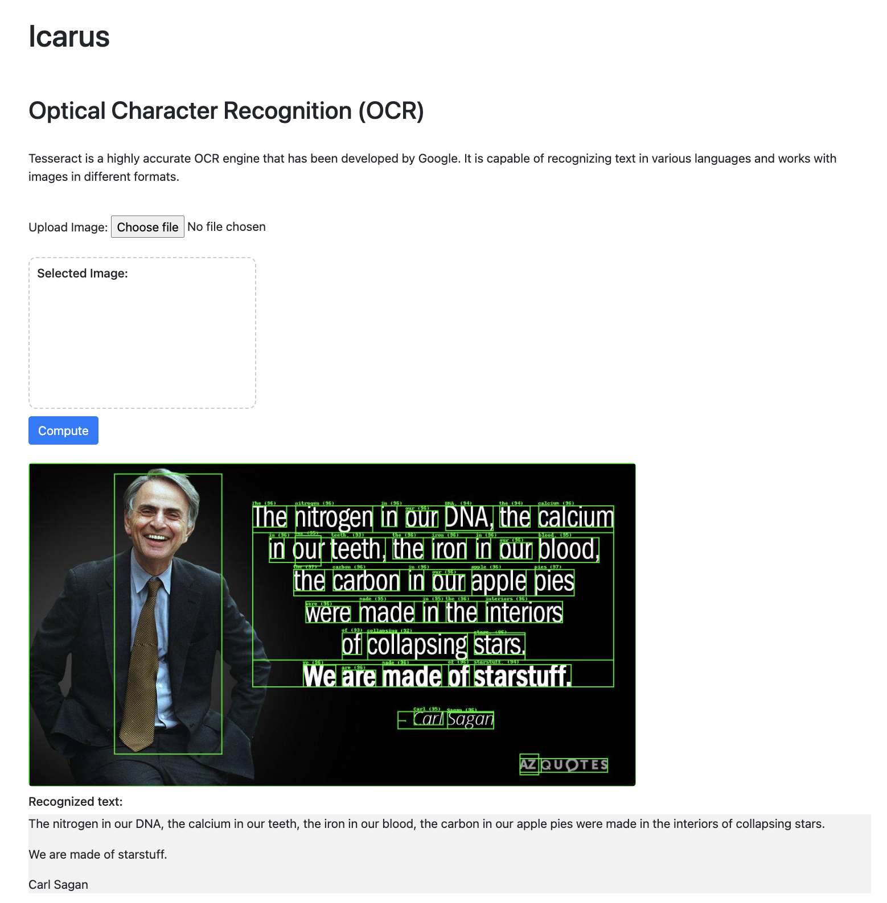
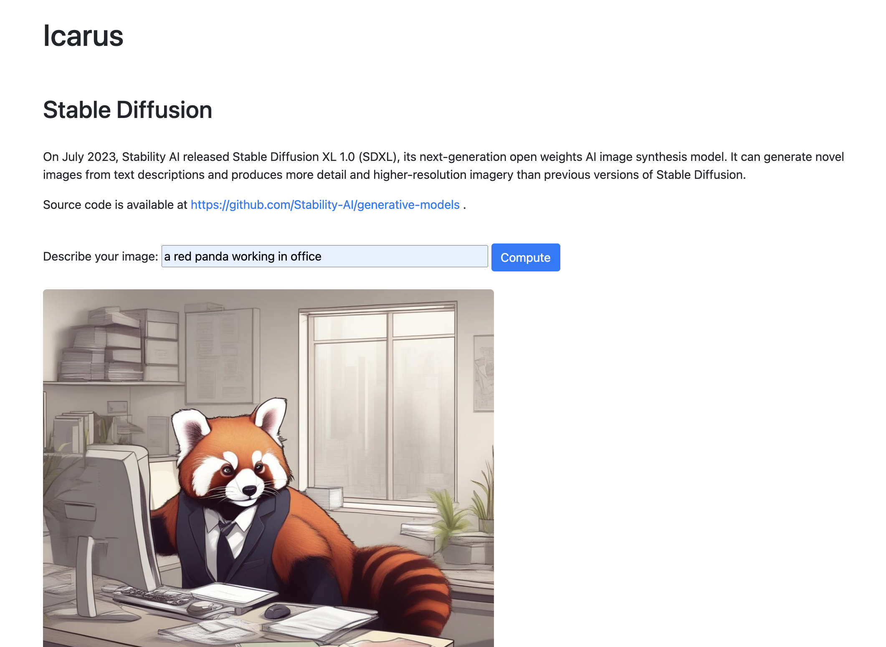

# Daedalus project
## Setup
- Fill in `config.py` your site configs
- Make sure your system have these applications:
  - `tesseract` : for OCR module. `brew install tesseract`
  - `ffmpeg` : for audio module. `brew install ffmpeg`

- Run: `python main.py`




## Setup ElasticSearch
```
docker run -d --name elasticsearch \               
  -p 9200:9200 -p 9300:9300 \
  -e "discovery.type=single-node" \
  docker.elastic.co/elasticsearch/elasticsearch:7.14.1
```

## Icarus
Icarus is the hub for AI services



