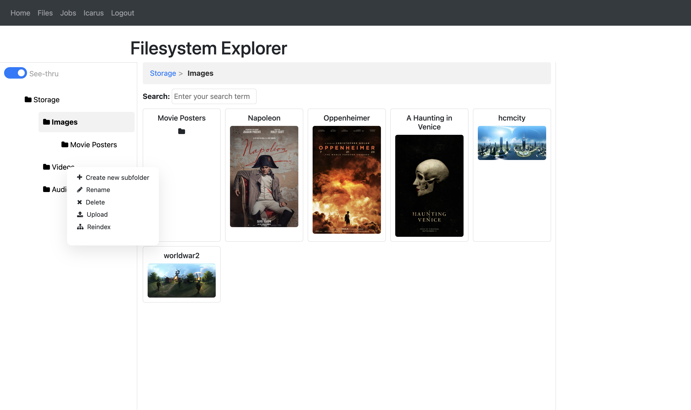

# Daedalus project
Run:
```
python main.py
```


## Setup ElasticSearch
```
docker run -d --name elasticsearch \               
  -p 9200:9200 -p 9300:9300 \
  -e "discovery.type=single-node" \
  docker.elastic.co/elasticsearch/elasticsearch:7.14.1
```

## Setup Icarus
Icarus is the hub for AI services. Some services require certain installations on the hosting server:
- OCR: `brew install tesseract`

